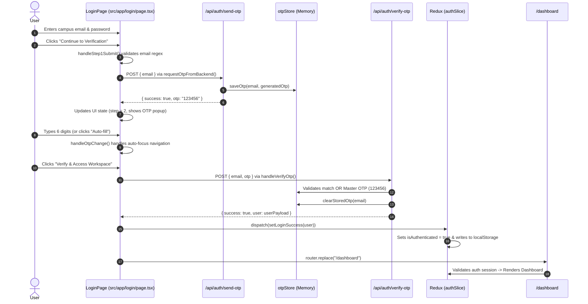
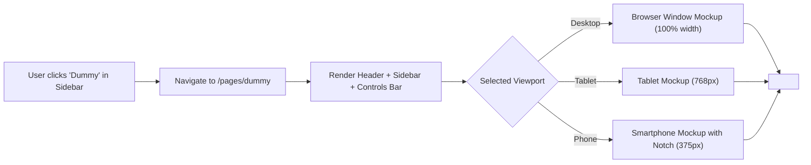

# Campus Commerce — Architecture & Implementation Guide

A quick-reference guide explaining the architecture, data flow, function calls, and authentication lifecycle of the Campus Commerce application.

---

## 1. Project Tech Stack & Overview

- **Framework**: Next.js 16 (App Router with Turbopack)
- **Language**: TypeScript
- **Styling**: Tailwind CSS v4 (with custom theme tokens in `globals.css`)
- **State Management**: Redux Toolkit (with `localStorage` persistence)
- **Primary Routes**:
  - `/` &rarr; Redirects automatically to `/login`
  - `/login` &rarr; Multi-step authentication (Step 1: Credentials, Step 2: 2FA OTP)
  - `/dashboard` &rarr; Protected home dashboard with interactive sidebar & header
  - `/pages/dummy` &rarr; Dummy page with responsive iframe viewer and device mockups
  - `/dummy-content` &rarr; Standalone sample marketplace page rendered inside the iframe
  - `/pages/customers`, `/pages/orders`, `/pages/product` &rarr; Feature pages

---

## 2. Project File Structure & Responsibilities

```
src/
├── app/
│   ├── api/auth/
│   │   ├── send-otp/route.ts      # Generates 6-digit OTP & stores in backend memory
│   │   └── verify-otp/route.ts    # Validates submitted OTP or Master OTP (123456)
│   ├── dashboard/
│   │   └── page.tsx               # Protected dashboard home; guards against unauthenticated users
│   ├── dummy-content/
│   │   └── page.tsx               # Standalone sample content page embedded inside the iframe
│   ├── pages/
│   │   ├── dummy/page.tsx         # Dummy page with responsive iframe (Desktop, Tablet, Phone + Notch)
│   │   ├── product/page.tsx       # Products catalog with Yan copilot & metric cards
│   │   ├── orders/page.tsx        # Orders list page
│   │   └── customers/page.tsx     # Customers list page
│   ├── login/
│   │   └── page.tsx               # Full 2-step Auth screen (Credentials + 2FA Verification)
│   ├── layout.tsx                 # Root layout & Redux StoreProvider wrapper
│   ├── globals.css                # Tailwind theme tokens & color variables
│   └── page.tsx                   # Root redirect to /login
├── components/
│   ├── Header.tsx                 # Global top navigation bar (User badge, ⌘K search, mobile menu)
│   └── Sidebar.tsx                # Left navigation sidebar (Updated: Discount renamed to Dummy)
├── lib/
│   └── otpStore.ts                # In-memory OTP dictionary & master bypass key
└── store/
    ├── slices/authSlice.ts        # Redux slice managing user auth & localStorage sync
    ├── hooks.ts                   # Typed Redux hooks (`useAppDispatch`, `useAppSelector`)
    ├── store.ts                   # Redux store configuration
    └── StoreProvider.tsx          # Client-side Redux Provider wrapper
```

---

## 3. End-to-End Authentication & Function Flow



### Detailed Flow Walkthrough

#### Step 1: Login Form (`/login` with `step === 1`)
1. User enters email and password.
2. Clicking **"Continue to Verification"** fires `handleStep1Submit(e)`.
3. `handleStep1Submit`:
   - Validates email format using `EMAIL_REGEX`.
   - Calls `requestOtpFromBackend(cleanEmail)`.
4. `requestOtpFromBackend`:
   - Sends `POST /api/auth/send-otp`.
   - The route handler generates a random 6-digit code and calls `saveOtp(email, otp)`.
   - On response, stores `generatedOtp`, sets `popupOtp` (simulating SMS notification), sets `resendTimer(48)`, pushes history state (`campusStep: 2`), and transitions UI to `step = 2`.

#### Step 2: Two-Step 2FA Verification (`step === 2`)
1. User receives the simulated SMS alert box at the top right.
   - User can click **"Auto-fill"** to immediately populate the 6 boxes, or type them manually.
2. `handleOtpChange(index, val)` auto-advances the cursor to the next input box; `handleOtpKeyDown` handles backspacing.
3. Clicking **"Verify & Access Workspace"** fires `handleVerifyOtp(e)`.
4. `handleVerifyOtp`:
   - Joins digits `otp.join("")`.
   - Sends `POST /api/auth/verify-otp`.
   - The route handler verifies against `getStoredOtp(email)` or accepts the fallback **Master OTP (`123456`)**.
   - If verified, it clears the stored OTP and returns the complete student/admin `user` profile.
5. On success:
   - Dispatches `setLoginSuccess(data.user)` to the Redux store.
   - Redux saves user to state and synchronizes with `localStorage.setItem("campus_user", ...)`.
   - Calls `router.replace("/dashboard")`.

#### Step 3: Route Protection & Dashboard (`/dashboard`)
1. `/dashboard` mounts and reads state via `useAppSelector((state) => state.auth)`.
2. If `!isAuthenticated` and no `campus_user` is found in `localStorage`, it redirects to `/login`.
3. If authenticated, renders the top `Header` and `Sidebar`.
4. Clicking **"Log Out"** in the sidebar calls `dispatch(logout())`, clearing Redux state, deleting `campus_user` from `localStorage`, and redirecting to `/login`.

---

## 4. Key Functions & Event Triggers

| Function | Trigger / Element | Location | Purpose |
| :--- | :--- | :--- | :--- |
| `handleStep1Submit` | "Continue to Verification" button | `login/page.tsx` | Validates email input and initiates backend OTP generation. |
| `requestOtpFromBackend` | Form submit or "Resend code" button | `login/page.tsx` | Sends `POST /api/auth/send-otp` to fetch a new 6-digit verification code. |
| `handleOtpChange` | Typing inside any of the 6 OTP input boxes | `login/page.tsx` | Sanitizes digit inputs and auto-focuses the next input box. |
| `handleOtpKeyDown` | Pressing `Backspace` inside an OTP box | `login/page.tsx` | Auto-focuses the preceding input box when current box is empty. |
| `handleVerifyOtp` | "Verify & Access Workspace" button | `login/page.tsx` | Sends `POST /api/auth/verify-otp` to validate code and dispatch Redux login. |
| `handleReturnToStep1` | "Edit email" or "Cancel" button | `login/page.tsx` | Reverts form from Step 2 back to Step 1. |
| `setLoginSuccess` | Verified OTP response | `authSlice.ts` | Sets `isAuthenticated = true`, stores user payload, and saves to `localStorage`. |
| `logout` | "Log Out" button in Sidebar or page reload | `authSlice.ts` | Resets auth state to `null` and purges `localStorage`. |
| `saveOtp` | `/api/auth/send-otp` | `otpStore.ts` | Caches `{ email: otp }` pair in global memory. |
| `getStoredOtp` | `/api/auth/verify-otp` | `otpStore.ts` | Fetches active OTP for verification comparison. |
| `setViewport` | Device buttons (🖥️ Desktop / 💻 Tablet / 📱 Phone) | `pages/dummy/page.tsx` | Switches iframe wrapper between desktop browser, tablet, and phone mockup. |
| `handleReload` | "Reload" button (🔄) | `pages/dummy/page.tsx` | Forces the `<iframe>` to reload by incrementing its React key. |

---

## 5. Dummy Page & Iframe Integration (Feature Guide)

### Goal & Implementation Summary
1. **Renamed Discount to Dummy**: In `src/components/Sidebar.tsx`, the menu item formerly called "Discount" was renamed to "Dummy" with icon `📄` and linked directly to `/pages/dummy`.
2. **Created Embedded Source Route (`/dummy-content`)**: A standalone, lightweight Next.js page at `src/app/dummy-content/page.tsx`. It simulates a live student noticeboard and peer-to-peer campus exchange with interactive like counts, category filters, and item listings.
3. **Created Main Dummy Page (`/pages/dummy`)**: Built at `src/app/pages/dummy/page.tsx` with standard dashboard structure (`Header` + `Sidebar`), embedding an `<iframe>` pointing to `/dummy-content`.
4. **Device Mockup Switcher**:
   - **📱 Phone Mockup (375px)**: Displays a realistic smartphone shell featuring outer bezels, time/5G status bar, home indicator, and a **center camera/speaker notch**.
   - **💻 Tablet Mockup (768px)**: Displays a sleek tablet frame with rounded corners and a top camera dot.
   - **🖥️ Desktop Mockup (100% width)**: Displays a browser window with control dots (red/yellow/green) and a secure address bar.
   - **Physical Mobile Responsiveness**: When viewed on actual smartphones, the iframe automatically expands to 100% width with smooth native touch scrolling.



---