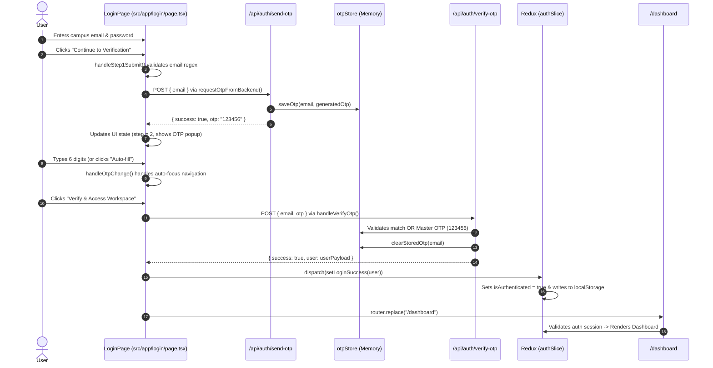
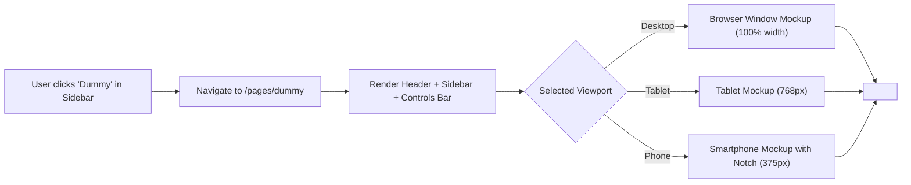
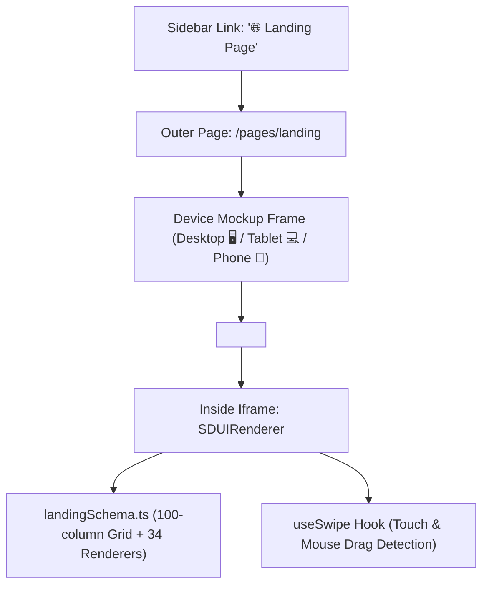
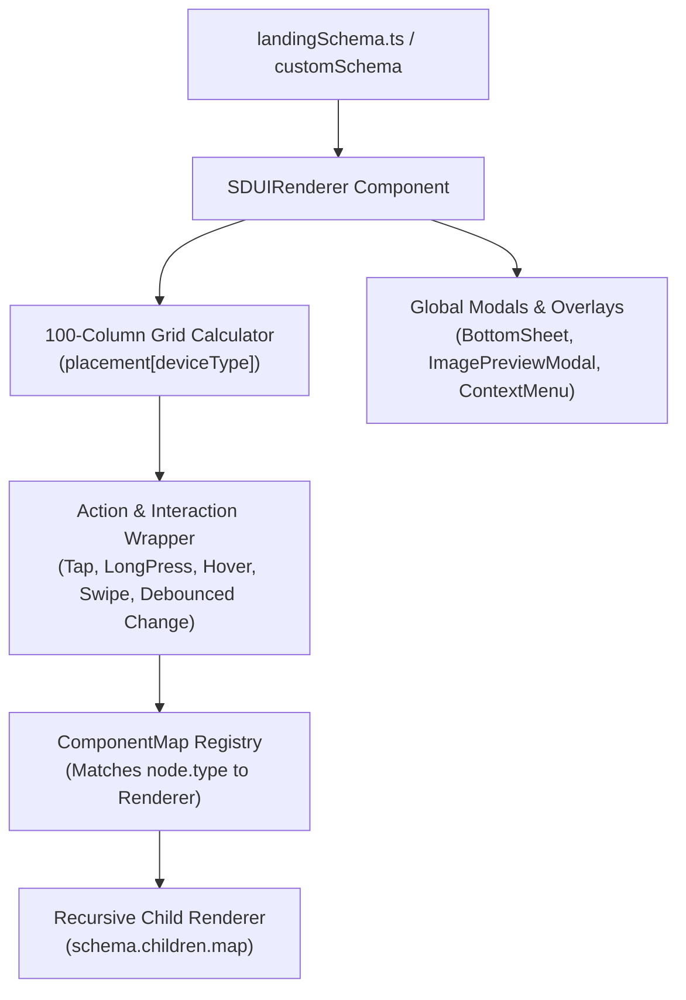

# Campus Commerce — Architecture & Implementation Guide

A quick-reference guide explaining the architecture, data flow, function calls, and authentication lifecycle of the Campus Commerce application.

---

## 1. Project Tech Stack & Overview

- **Framework**: Next.js 16 (App Router with Turbopack)
- **Language**: TypeScript
- **Styling**: Tailwind CSS v4 (with custom theme tokens in `globals.css`)
- **State Management**: Redux Toolkit (with `localStorage` persistence)
- **Primary Routes**:
  - `/` &rarr; Redirects automatically to `/login`
  - `/login` &rarr; Multi-step authentication (Step 1: Credentials, Step 2: 2FA OTP)
  - `/dashboard` &rarr; Protected home dashboard with interactive sidebar & header
  - `/pages/dummy` &rarr; Dummy page with responsive iframe viewer and device mockups
  - `/dummy-content` &rarr; Standalone sample marketplace page rendered inside the iframe
  - `/pages/customers`, `/pages/orders`, `/pages/product` &rarr; Feature pages

---

## 2. Project File Structure & Responsibilities

```
src/
├── app/
│   ├── api/auth/
│   │   ├── send-otp/route.ts      # Generates 6-digit OTP & stores in backend memory
│   │   └── verify-otp/route.ts    # Validates submitted OTP or Master OTP (123456)
│   ├── dashboard/
│   │   └── page.tsx               # Protected dashboard home; guards against unauthenticated users
│   ├── dummy-content/
│   │   └── page.tsx               # Standalone sample content page embedded inside the iframe
│   ├── pages/
│   │   ├── dummy/page.tsx         # Dummy page with responsive iframe (Desktop, Tablet, Phone + Notch)
│   │   ├── product/page.tsx       # Products catalog with Yan copilot & metric cards
│   │   ├── orders/page.tsx        # Orders list page
│   │   └── customers/page.tsx     # Customers list page
│   ├── login/
│   │   └── page.tsx               # Full 2-step Auth screen (Credentials + 2FA Verification)
│   ├── layout.tsx                 # Root layout & Redux StoreProvider wrapper
│   ├── globals.css                # Tailwind theme tokens & color variables
│   └── page.tsx                   # Root redirect to /login
├── components/
│   ├── Header.tsx                 # Global top navigation bar (User badge, ⌘K search, mobile hamburger menu)
│   └── Sidebar.tsx                # Responsive navigation sidebar & mobile drawer (Full-height sheet, backdrop, scroll-lock, auto-close)
├── lib/
│   └── otpStore.ts                # In-memory OTP dictionary & master bypass key
└── store/
    ├── slices/authSlice.ts        # Redux slice managing user auth & localStorage sync
    ├── hooks.ts                   # Typed Redux hooks (`useAppDispatch`, `useAppSelector`)
    ├── store.ts                   # Redux store configuration
    └── StoreProvider.tsx          # Client-side Redux Provider wrapper
```

---

## 3. End-to-End Authentication & Function Flow


```mermaid
sequenceDiagram
    autonumber
    actor User
    participant Login as LoginPage (src/app/login/page.tsx)
    participant SendAPI as /api/auth/send-otp
    participant Store as otpStore (Memory)
    participant VerifyAPI as /api/auth/verify-otp
    participant Redux as Redux (authSlice)
    participant Dash as /dashboard

    %% STEP 1
    User->>Login: Enters campus email & password
    User->>Login: Clicks "Continue to Verification"
    Login->>Login: handleStep1Submit() validates email regex
    Login->>SendAPI: POST { email } via requestOtpFromBackend()
    SendAPI->>Store: saveOtp(email, generatedOtp)
    SendAPI-->>Login: { success: true, otp: "123456" }
    Login->>Login: Updates UI state (step = 2, shows OTP popup)

    %% STEP 2
    User->>Login: Types 6 digits (or clicks "Auto-fill")
    Login->>Login: handleOtpChange() handles auto-focus navigation
    User->>Login: Clicks "Verify & Access Workspace"
    Login->>VerifyAPI: POST { email, otp } via handleVerifyOtp()
    VerifyAPI->>Store: Validates match OR Master OTP (123456)
    VerifyAPI->>Store: clearStoredOtp(email)
    VerifyAPI-->>Login: { success: true, user: userPayload }

    %% STEP 3
    Login->>Redux: dispatch(setLoginSuccess(user))
    Redux->>Redux: Sets isAuthenticated = true & writes to localStorage
    Login->>Dash: router.replace("/dashboard")
    Dash->>Redux: Validates auth session -> Renders Dashboard
```

### Detailed Flow Walkthrough

#### Step 1: Login Form (`/login` with `step === 1`)
1. User enters email and password.
2. Clicking **"Continue to Verification"** fires `handleStep1Submit(e)`.
3. `handleStep1Submit`:
   - Validates email format using `EMAIL_REGEX`.
   - Calls `requestOtpFromBackend(cleanEmail)`.
4. `requestOtpFromBackend`:
   - Sends `POST /api/auth/send-otp`.
   - The route handler generates a random 6-digit code and calls `saveOtp(email, otp)`.
   - On response, stores `generatedOtp`, sets `popupOtp` (simulating SMS notification), sets `resendTimer(48)`, pushes history state (`campusStep: 2`), and transitions UI to `step = 2`.

#### Step 2: Two-Step 2FA Verification (`step === 2`)
1. User receives the simulated SMS alert box at the top right.
   - User can click **"Auto-fill"** to immediately populate the 6 boxes, or type them manually.
2. `handleOtpChange(index, val)` auto-advances the cursor to the next input box; `handleOtpKeyDown` handles backspacing.
3. Clicking **"Verify & Access Workspace"** fires `handleVerifyOtp(e)`.
4. `handleVerifyOtp`:
   - Joins digits `otp.join("")`.
   - Sends `POST /api/auth/verify-otp`.
   - The route handler verifies against `getStoredOtp(email)` or accepts the fallback **Master OTP (`123456`)**.
   - If verified, it clears the stored OTP and returns the complete student/admin `user` profile.
5. On success:
   - Dispatches `setLoginSuccess(data.user)` to the Redux store.
   - Redux saves user to state and synchronizes with `localStorage.setItem("campus_user", ...)`.
   - Calls `router.replace("/dashboard")`.

#### Step 3: Route Protection & Dashboard (`/dashboard`)
1. `/dashboard` mounts and reads state via `useAppSelector((state) => state.auth)`.
2. If `!isAuthenticated` and no `campus_user` is found in `localStorage`, it redirects to `/login`.
3. If authenticated, renders the top `Header` and `Sidebar`.
4. Clicking **"Log Out"** in the sidebar calls `dispatch(logout())`, clearing Redux state, deleting `campus_user` from `localStorage`, and redirecting to `/login`.

---

## 4. Key Functions & Event Triggers

| Function | Trigger / Element | Location | Purpose |
| :--- | :--- | :--- | :--- |
| `handleStep1Submit` | "Continue to Verification" button | `login/page.tsx` | Validates email input and initiates backend OTP generation. |
| `requestOtpFromBackend` | Form submit or "Resend code" button | `login/page.tsx` | Sends `POST /api/auth/send-otp` to fetch a new 6-digit verification code. |
| `handleOtpChange` | Typing inside any of the 6 OTP input boxes | `login/page.tsx` | Sanitizes digit inputs and auto-focuses the next input box. |
| `handleOtpKeyDown` | Pressing `Backspace` inside an OTP box | `login/page.tsx` | Auto-focuses the preceding input box when current box is empty. |
| `handleVerifyOtp` | "Verify & Access Workspace" button | `login/page.tsx` | Sends `POST /api/auth/verify-otp` to validate code and dispatch Redux login. |
| `handleReturnToStep1` | "Edit email" or "Cancel" button | `login/page.tsx` | Reverts form from Step 2 back to Step 1. |
| `setLoginSuccess` | Verified OTP response | `authSlice.ts` | Sets `isAuthenticated = true`, stores user payload, and saves to `localStorage`. |
| `logout` | "Log Out" button in Sidebar or page reload | `authSlice.ts` | Resets auth state to `null` and purges `localStorage`. |
| `saveOtp` | `/api/auth/send-otp` | `otpStore.ts` | Caches `{ email: otp }` pair in global memory. |
| `getStoredOtp` | `/api/auth/verify-otp` | `otpStore.ts` | Fetches active OTP for verification comparison. |
| `setViewport` | Device buttons (🖥️ Desktop / 💻 Tablet / 📱 Phone) | `pages/dummy/page.tsx` | Switches iframe wrapper between desktop browser, tablet, and phone mockup. |
| `handleReload` | "Reload" button (🔄) | `pages/dummy/page.tsx` | Forces the `<iframe>` to reload by incrementing its React key. |

---

## 5. Dummy Page & Iframe Integration (Feature Guide)

### Goal & Implementation Summary
1. **Renamed Discount to Dummy**: In `src/components/Sidebar.tsx`, the menu item formerly called "Discount" was renamed to "Dummy" with icon `📄` and linked directly to `/pages/dummy`.
2. **Created Embedded Source Route (`/dummy-content`)**: A standalone, lightweight Next.js page at `src/app/dummy-content/page.tsx`. It simulates a live student noticeboard and peer-to-peer campus exchange with interactive like counts, category filters, and item listings.
3. **Created Main Dummy Page (`/pages/dummy`)**: Built at `src/app/pages/dummy/page.tsx` with standard dashboard structure (`Header` + `Sidebar`), embedding an `<iframe>` pointing to `/dummy-content`.
4. **Device Mockup Switcher**:
   - **📱 Phone Mockup (375px)**: Displays a realistic smartphone shell featuring outer bezels, time/5G status bar, home indicator, and a **center camera/speaker notch**.
   - **💻 Tablet Mockup (768px)**: Displays a sleek tablet frame with rounded corners and a top camera dot.
   - **🖥️ Desktop Mockup (100% width)**: Displays a browser window with control dots (red/yellow/green) and a secure address bar.
   - **Physical Mobile Responsiveness**: When viewed on actual smartphones, the iframe automatically expands to 100% width with smooth native touch scrolling.


```mermaid
flowchart LR
    A[User clicks 'Dummy' in Sidebar] --> B["Navigate to /pages/dummy"]
    B --> C["Render Header + Sidebar + Controls Bar"]
    C --> D{"Selected Viewport"}
    D -->|Desktop| E["Browser Window Mockup (100% width)"]
    D -->|Tablet| F["Tablet Mockup (768px)"]
    D -->|Phone| G["Smartphone Mockup with Notch (375px)"]
    E & F & G --> H["<iframe src='/dummy-content' />"]
```

---

## 6. Server-Driven UI (SDUI) Architecture & Responsive Iframe

### Overview & Goal
Porting the Server-Driven UI (SDUI) engine and schema from Vite/React to Next.js 16 (App Router + TypeScript). The SDUI system dynamically interprets a JSON blueprint (`landingSchema.ts`) and mounts 34 modular React components onto a 100-column responsive grid layout inside an interactive device mockup iframe.


```mermaid
flowchart TD
    A["Sidebar Link: '🌐 Landing Page'"] --> B["Outer Page: /pages/landing"]
    B --> C["Device Mockup Frame (Desktop 🖥️ / Tablet 💻 / Phone 📱)"]
    C --> D["<iframe src='/landing-content' />"]
    D --> E["Inside Iframe: SDUIRenderer"]
    E --> F["landingSchema.ts (100-column Grid + 34 Renderers)"]
    E --> G["useSwipe Hook (Touch & Mouse Drag Detection)"]
```

### File Structure & Responsibilities

```
src/
├── sdui/
│   ├── types.ts                     # TypeScript definitions (DeviceType, GridPlacement, SDUIAction, SDUINode, BaseRendererProps)
│   ├── landingSchema.ts             # Complete fullPageJSON blueprint (~3,400 lines) with UTF-8 clean emojis
│   ├── hooks/
│   │   └── useSwipe.ts              # Custom gesture hook for touch (mobile) and mouse drag (desktop) swipe events
│   ├── renderers/                   # (In Progress) 34 individual component renderers (.tsx)
│   └── SDUIRenderer.tsx             # (Upcoming) Main recursive SDUI engine, action dispatcher & device sensing
└── app/
    ├── landing-content/page.tsx     # (Upcoming) Standalone iframe content page running SDUIRenderer
    └── pages/landing/page.tsx       # (Upcoming) Outer dashboard page with responsive Phone/Tablet/Desktop mockups
```

### Key Functions, Hooks & Lifecycle

| Function / Hook | Location | Trigger / Event | Description |
| :--- | :--- | :--- | :--- |
| `useSwipe` | `src/sdui/hooks/useSwipe.ts` | Touch (`onTouchStart`, `onTouchEnd`) & Mouse (`onMouseDown`, `onMouseUp`) | Calculates drag delta `distanceX` & `distanceY`. If delta exceeds `minSwipeDistance` (default 50px), fires horizontal or vertical swipe callback. |
| `GridPlacement` | `src/sdui/types.ts` | Layout coordinate calculation | Sets CSS grid positioning: `gridColumn: colStart / colEnd` and `gridRow: rowStart / rowEnd` on a 100-column grid. |
| `SDUIActions` | `src/sdui/types.ts` | User interactions | Defines event handlers (`onTap`, `onSwipeLeft`, `onLongPress`, `onHover`, `onMount`, `onScroll`, etc.). |
| `fullPageJSON` | `src/sdui/landingSchema.ts` | Schema import | Full tree of components: Header, SearchBar, StoryRow, CategoryGrid, Carousel, HeroBanner, CouponCode, CountDownTimer, ProductList, ProductGrid, Footer, NavBar. |

### Component Renderers Reference (35 Renderers in `src/sdui/renderers/`)

| Category | Component File | Interactive Hooks / State | Purpose / Display |
| :--- | :--- | :--- | :--- |
| **Header & Navigation** | `HeaderRenderer.tsx` | Pure Layout | Dark green header bar with padding and scroll isolation. |
| | `HeaderButtonRenderer.tsx` | Pure Layout + `onClick` | Rounded button inside header with icon and label. |
| | `NavBarRenderer.tsx` | Pure Layout + `onNavigate` | Bottom mobile app bar with icons, labels, and active route highlight. |
| | `SearchBarRenderer.tsx` | `useState(query)` | Rounded search input bar with search icon. |
| **Products & Display** | `ProductCardRenderer.tsx` | `useState(isHovered)` | Product card with hover quick-add pill (`⚡ Quick Add`). |
| | `ProductListRenderer.tsx` | Pure Layout | Scrollable horizontal/grid product list container. |
| | `CategoryGridRenderer.tsx` | Pure Layout | Horizontal scrolling category pill container. |
| | `CategoryItemRenderer.tsx` | Pure Layout + `onClick` | Circular icon bubble with category label. |
| | `CarouselRenderer.tsx` | `useState`, `useEffect`, `useSwipe` | Interactive auto-playing banner carousel with dot indicators. |
| | `HeroBannerRenderer.tsx` | Pure Layout | Full-width promotional banner image with title/subtitle overlay. |
| **Details & Badges** | `PriceBlockRenderer.tsx` | Pure Layout | Shows sellingPrice, strikethrough MRP, and percentage discount tag. |
| | `BadgeRenderer.tsx` | Pure Layout | Compact colored pill badge (e.g. "50% OFF", "Best Seller"). |
| | `RatingRenderer.tsx` | Pure Layout | Star rating display with numeric value. |
| | `ScoreRenderer.tsx` | Pure Layout | Review score container (e.g. "4.8 out of 5"). |
| | `ReviewCountRenderer.tsx`| Pure Layout | Total count of student reviews. |
| | `OfferTextRenderer.tsx` | Pure Layout | Promotional text banner with highlighted discount wording. |
| | `DeliveryInfoRenderer.tsx`| Pure Layout | Dynamic delivery date calculation (`🚚 FREE delivery by date`). |
| | `CouponCodeRenderer.tsx` | `useState(copied)` | Dashed coupon box with copy code button (`Copied!`). |
| | `CountDownTimerRenderer.tsx`| `useState`, `useEffect` | Live ticking countdown timer until targetDate. |
| **Containers & Layout** | `PageRenderer.tsx` | Pure Layout | The core 100-column virtual CSS Grid container (`repeat(100, 1fr)`). |
| | `HomeRenderer.tsx` | Pure Layout | Root page container wrapping the Page and NavBar. |
| | `BoxRenderer.tsx` | Pure Layout | General-purpose styled div container for grouping children. |
| | `FooterRenderer.tsx` | Pure Layout + hover | Dark multi-column footer with links and copyright notice. |
| | `StoryRowRenderer.tsx` | Pure Layout | Horizontal scrolling story bubble row. |
| | `StoryCircleRenderer.tsx` | Pure Layout + `onClick` | Gradient-bordered circular story avatar. |
| **Primitives & Actions** | `ButtonRenderer.tsx` | Pure Layout + `onClick` | Standalone action button with custom styling. |
| | `DescriptionRenderer.tsx`| Pure Layout | Multi-line text description with line clamping. |
| | `IconRenderer.tsx` | Pure Layout + `onClick` | Standalone SVG/emoji icon button. |
| | `IFrameRenderer.tsx` | Pure Layout | Sandboxed iframe embed component. |
| | `ImageRenderer.tsx` | Pure Layout | Responsive image component with safe fallback styles. |
| | `LabelRenderer.tsx` | Pure Layout | Minor subtitle or field label text. |
| | `ShareButtonRenderer.tsx`| Pure Layout + `onClick` | Share action button with share icon. |
| | `SponsoredRenderer.tsx` | Pure Layout | Subtle "Sponsored" tag label. |
| | `TextRenderer.tsx` | Pure Layout | Generic typography paragraph block. |
| | `TitleRenderer.tsx` | Pure Layout | Prominent section heading. |

### SDUI Engine Architecture (`src/sdui/SDUIRenderer.tsx`)

The main engine bridges the declarative JSON schema with React runtime rendering:


```mermaid
flowchart TD
    A["landingSchema.ts / customSchema"] --> B["SDUIRenderer Component"]
    B --> C["100-Column Grid Calculator<br/>(placement[deviceType])"]
    C --> D["Action & Interaction Wrapper<br/>(Tap, LongPress, Hover, Swipe, Debounced Change)"]
    D --> E["ComponentMap Registry<br/>(Matches node.type to Renderer)"]
    E --> F["Recursive Child Renderer<br/>(schema.children.map)"]
    B --> G["Global Modals & Overlays<br/>(BottomSheet, ImagePreviewModal, ContextMenu)"]
```

#### Core Engine Mechanisms:
1. **ComponentMap Registry**:
   - Maps each schema `type` (e.g. `"ProductCard"`, `"CategoryGrid"`) to its corresponding component imported from `src/sdui/renderers/`.
2. **100-Column Virtual Grid Placement**:
   - Reads `schema.placement[deviceType]` (mobile, tablet, desktop) and generates standard CSS grid coordinates:
     `gridColumn: ${coordinates.colStart} / ${coordinates.colEnd}`
     `gridRow: ${coordinates.rowStart} / ${coordinates.rowEnd}`
3. **Action Dispatcher**:
   - `onTap` &rarr; Triggers route navigation, bottom sheet modal, image preview modal, or custom action.
   - `onLongPress` &rarr; Opens context menu with options list.
   - `onSwipeLeft / Right / Up / Down` &rarr; Powered by `useSwipe` for carousels and swipeable banners.
   - `onChange` &rarr; Features built-in 500ms debouncing for responsive search inputs.
   - `onScroll / onEndReached` &rarr; Triggers lazy loading deal items with loader spinner.
4. **Dual Display Mode**:
   - **Embedded Mode (`hideEditor={true}`)**: Ideal for iframe previewing; displays pure edge-to-edge landing page with auto-sensing viewport.
   - **Studio Mode (`hideEditor={false}`)**: Side-by-side JSON editor with syntax validation, template presets, and manual device mode toggles.

---

### Implementation Progress Checklist
- [x] **Step 1: Setup Types & Schema Data**
  - [x] `src/sdui/types.ts` created with clean TypeScript definitions.
  - [x] `src/sdui/landingSchema.ts` migrated with 100% data fidelity & verified UTF-8 emojis.
- [x] **Step 2: Swipe & Gesture Hooks**
  - [x] `src/sdui/hooks/useSwipe.ts` implemented with `"use client"` and touch/mouse drag handlers.
- [x] **Step 3: Component Renderers (35 Components)**
  - [x] Created all 35 renderers in `src/sdui/renderers/`.
  - [x] Added `"use client"` and `BaseRendererProps` to each component.
  - [x] Verified zero TypeScript compilation errors with `npx tsc --noEmit`.
- [x] **Step 4: Main SDUI Engine (`src/sdui/SDUIRenderer.tsx`)**
  - [x] Wired `ComponentMap` registry for all 35 renderers.
  - [x] Built 100-column responsive grid calculator with sticky positioning support.
  - [x] Integrated `useLongPress`, `ContextMenu`, `BottomSheet`, `ImagePreviewModal`.
  - [x] Added dual studio mode and embedded iframe mode (`hideEditor`).
- [x] **Step 5: Inner Route (`src/app/landing-content/page.tsx`)**
  - [x] Created standalone Next.js route embedding `<SDUIRenderer hideEditor={true} />`.
  - [x] Built responsive viewport auto-detection (Phone < 640px, Tablet < 1024px, Desktop >= 1024px) plus URL param override (`?device=`).
  - [x] Wrapped in React `<Suspense>` for production-grade client streaming.
- [x] **Step 6: Outer Viewer Page (`src/app/pages/landing/page.tsx`)**
  - [x] Built outer viewer page featuring global `Header` and `Sidebar`.
  - [x] Implemented responsive device mockups: Phone (375px with realistic Dynamic Island/notch & home indicator), Tablet (778px with bezel & camera), and Desktop (100% full-width browser window with address bar).
  - [x] Embedded `<iframe src="/landing-content?device=..." />` with dynamic viewport synchronization.
- [x] **Step 7: Sidebar Integration & Final Verification**
  - [x] Added `"landing"` to `SidebarItem` union in `src/components/Sidebar.tsx`.
  - [x] Added the **🌐 Landing Page** navigation item under the primary navigation bar.
  - [x] Verified project-wide TypeScript compilation (`npx tsc --noEmit` &rarr; 0 errors).
  - [x] Verified Next.js dev server HTTP 200 responses on `/landing-content` and `/pages/landing`.
  - [x] Verified full visual responsiveness across Desktop, Tablet (778px), and Phone (375px with Dynamic Island notch) via live browser testing.
  - [x] Removed visible scrollbars (`scrollbar-width: none`, `-ms-overflow-style: none`, `::-webkit-scrollbar: none`) across Phone and Tablet device frames while preserving native scroll.
  - [x] Adjusted Tablet frame container width to 778px (+10px width) across landing and dummy pages.

  Next Task : To create themes and interfaces properly for validation purpose as well...it should include everything imp...in that...I have created themes as well as interfaces ...I think themes are correct and proper but interfaces are not...Interfaces should contain keys like minValue : int,maxValue : int,allowedComponents : array , allowed actions : array etc etc etc and default data : { minValue : 2,maxValue:4,allowedComponents : For example for product list it will be product card etc etc etc} like that interfaces I need...so that ..for now as we are rendering our landingpage schema which calls the sduirenderer and page gets render...but now I want that user will select a theme and that theme json will go to the interface for validation properly and that will render...something like this I want to do now...interfaces will act as validators...for the json schema i.e. for now coming from themes...Please ensure that everything should be properly responsive for desktop,tablet as well as phone ...also ensure that the code should be very simple , easy to understand , beginner friendly as I am a newbie...


4. How the Validator Will Check This (4 Easy Checks)
When the user selects a theme, our validator will run these 4 simple checks for every node in the schema:

Check 1: Component Whitelist: Does child.type exist inside allowedComponents? (e.g., if someone puts a Footer inside a ProductCard, it gets flagged).
Check 2: Child Count Range: Is node.children.length between minValue and maxValue?
Check 3: Required Data Fields: Are the keys in requiredDataFields present in node.data? (e.g., does Button have label?).
Check 4: Allowed Actions: Are the actions configured on this node present in allowedActions?
If any rule fails, the validator won't crash — it reports clear errors or safely inserts defaultData and defaultStyle!

Here is the **exact, step-by-step procedure** we will follow to copy, modernize, validate, and wire up the themes and interfaces into Next.js. 

Everything is broken down into **6 clear phases** so you can follow along easily.

---

```
┌────────────────────────────────────────────────────────────────────────┐
│                        6-STEP IMPLEMENTATION ROADMAP                   │
└────────────────────────────────────────────────────────────────────────┘

  Step 1: Create Master Interface Contract
          └── Create src/sdui/interfaces/types.ts with your required keys

  Step 2: Create All 35 Component Interfaces
          └── Define rules (minValue, maxValue, allowedComponents, 
              allowedActions, defaultData, defaultStyle) for every component

  Step 3: Port Themes to Next.js (TypeScript + Clean UTF-8)
          └── Copy themes from CampusCommerce, convert .js to .ts, 
              restore clean emojis (🛒, ⚡, ❤️, 🏷️), export via index.ts

  Step 4: Build the Simple Validator Engine
          └── Create src/sdui/validator/validateSDUI.ts 
              Runs the 4 checks and safely applies fallback defaults

  Step 5: Build the Theme Applier Engine
          └── Create src/sdui/utils/themeApplier.ts
              Combines theme selection + schema validation into a safe output

  Step 6: Connect Theme Switcher to Landing Page & Test
          └── Add visual Theme Selector in /pages/landing
              Test live across Phone (375px), Tablet (778px), and Desktop
```

---

### Step 1: Create Master Java Validator Contract (Completed)
**Target Folder**: [`validators/src/com/campuscommerce/sdui/validators/`](file:///d:/Programming/Campus_Commerce/validators/src/com/campuscommerce/sdui/validators/)

- [x] **Setup Libraries**: Configured Jackson JSON parser jars (`jackson-core`, `jackson-databind`, `jackson-annotations`) inside [`validators/lib/`](file:///d:/Programming/Campus_Commerce/validators/lib/).
- [x] **Master Interface Contract**: Created [`ComponentValidator.java`](file:///d:/Programming/Campus_Commerce/validators/src/com/campuscommerce/sdui/validators/ComponentValidator.java) defining:
  - `getType()`
  - `getDisplayName()`
  - `getCategory()`
  - `isCompulsory()`
  - `getAllowedComponents()`
  - `getMinValue()` & `getMaxValue()`
  - `getAllowedActions()`
  - `getRequiredDataFields()`
  - `getDefaultData()` & `getDefaultStyle()`
  - `validate(JsonNode node)`
- [x] **Base Reusable Engine**: Created [`BaseComponentValidator.java`](file:///d:/Programming/Campus_Commerce/validators/src/com/campuscommerce/sdui/validators/BaseComponentValidator.java) implementing the standard 4-point validation logic:
  1. Children count range check (`minValue` <= count <= `maxValue`)
  2. Component whitelist check (`allowedComponents`)
  3. Required data fields check (`requiredDataFields`)
  4. Allowed actions check (`allowedActions`)
- [x] **Verified Compilation**: Successfully compiled with `javac 17` into `validators/bin/` with 0 errors.
- [x] **Verified Sample Validators**: Created and compiled [`ProductListValidator.java`](file:///d:/Programming/Campus_Commerce/validators/src/com/campuscommerce/sdui/validators/ProductListValidator.java) and [`ProductCardValidator.java`](file:///d:/Programming/Campus_Commerce/validators/src/com/campuscommerce/sdui/validators/ProductCardValidator.java).

---

### Step 2: Create All 35 Java Component Validators (Completed)
**Target Folder**: [`validators/src/com/campuscommerce/sdui/validators/`](file:///d:/Programming/Campus_Commerce/validators/src/com/campuscommerce/sdui/validators/)

- [x] **Navigation & Header (5 Validators)**:
  - [`HeaderValidator.java`](file:///d:/Programming/Campus_Commerce/validators/src/com/campuscommerce/sdui/validators/HeaderValidator.java)
  - [`HeaderButtonValidator.java`](file:///d:/Programming/Campus_Commerce/validators/src/com/campuscommerce/sdui/validators/HeaderButtonValidator.java)
  - [`NavBarValidator.java`](file:///d:/Programming/Campus_Commerce/validators/src/com/campuscommerce/sdui/validators/NavBarValidator.java)
  - [`FooterValidator.java`](file:///d:/Programming/Campus_Commerce/validators/src/com/campuscommerce/sdui/validators/FooterValidator.java)
  - [`SearchBarValidator.java`](file:///d:/Programming/Campus_Commerce/validators/src/com/campuscommerce/sdui/validators/SearchBarValidator.java)
- [x] **Banners & Marketing (4 Validators)**:
  - [`HeroBannerValidator.java`](file:///d:/Programming/Campus_Commerce/validators/src/com/campuscommerce/sdui/validators/HeroBannerValidator.java)
  - [`CarouselValidator.java`](file:///d:/Programming/Campus_Commerce/validators/src/com/campuscommerce/sdui/validators/CarouselValidator.java)
  - [`CountDownTimerValidator.java`](file:///d:/Programming/Campus_Commerce/validators/src/com/campuscommerce/sdui/validators/CountDownTimerValidator.java)
  - [`CouponCodeValidator.java`](file:///d:/Programming/Campus_Commerce/validators/src/com/campuscommerce/sdui/validators/CouponCodeValidator.java)
- [x] **Category & Discovery (4 Validators)**:
  - [`CategoryGridValidator.java`](file:///d:/Programming/Campus_Commerce/validators/src/com/campuscommerce/sdui/validators/CategoryGridValidator.java)
  - [`CategoryItemValidator.java`](file:///d:/Programming/Campus_Commerce/validators/src/com/campuscommerce/sdui/validators/CategoryItemValidator.java)
  - [`StoryRowValidator.java`](file:///d:/Programming/Campus_Commerce/validators/src/com/campuscommerce/sdui/validators/StoryRowValidator.java)
  - [`StoryCircleValidator.java`](file:///d:/Programming/Campus_Commerce/validators/src/com/campuscommerce/sdui/validators/StoryCircleValidator.java)
- [x] **Containers & Layout (4 Validators)**:
  - [`PageValidator.java`](file:///d:/Programming/Campus_Commerce/validators/src/com/campuscommerce/sdui/validators/PageValidator.java)
  - [`HomeValidator.java`](file:///d:/Programming/Campus_Commerce/validators/src/com/campuscommerce/sdui/validators/HomeValidator.java)
  - [`BoxValidator.java`](file:///d:/Programming/Campus_Commerce/validators/src/com/campuscommerce/sdui/validators/BoxValidator.java)
  - [`IFrameValidator.java`](file:///d:/Programming/Campus_Commerce/validators/src/com/campuscommerce/sdui/validators/IFrameValidator.java)
- [x] **Commerce & Lists (2 Validators)**:
  - [`ProductCardValidator.java`](file:///d:/Programming/Campus_Commerce/validators/src/com/campuscommerce/sdui/validators/ProductCardValidator.java)
  - [`ProductListValidator.java`](file:///d:/Programming/Campus_Commerce/validators/src/com/campuscommerce/sdui/validators/ProductListValidator.java)
- [x] **Commerce Atoms & Interactive (11 Validators)**:
  - [`ButtonValidator.java`](file:///d:/Programming/Campus_Commerce/validators/src/com/campuscommerce/sdui/validators/ButtonValidator.java)
  - [`BadgeValidator.java`](file:///d:/Programming/Campus_Commerce/validators/src/com/campuscommerce/sdui/validators/BadgeValidator.java)
  - [`PriceBlockValidator.java`](file:///d:/Programming/Campus_Commerce/validators/src/com/campuscommerce/sdui/validators/PriceBlockValidator.java)
  - [`OfferTextValidator.java`](file:///d:/Programming/Campus_Commerce/validators/src/com/campuscommerce/sdui/validators/OfferTextValidator.java)
  - [`DeliveryInfoValidator.java`](file:///d:/Programming/Campus_Commerce/validators/src/com/campuscommerce/sdui/validators/DeliveryInfoValidator.java)
  - [`RatingValidator.java`](file:///d:/Programming/Campus_Commerce/validators/src/com/campuscommerce/sdui/validators/RatingValidator.java)
  - [`ScoreValidator.java`](file:///d:/Programming/Campus_Commerce/validators/src/com/campuscommerce/sdui/validators/ScoreValidator.java)
  - [`ReviewCountValidator.java`](file:///d:/Programming/Campus_Commerce/validators/src/com/campuscommerce/sdui/validators/ReviewCountValidator.java)
  - [`ShareButtonValidator.java`](file:///d:/Programming/Campus_Commerce/validators/src/com/campuscommerce/sdui/validators/ShareButtonValidator.java)
  - [`SponsoredValidator.java`](file:///d:/Programming/Campus_Commerce/validators/src/com/campuscommerce/sdui/validators/SponsoredValidator.java)
  - [`IconValidator.java`](file:///d:/Programming/Campus_Commerce/validators/src/com/campuscommerce/sdui/validators/IconValidator.java)
- [x] **Typography & Media (5 Validators)**:
  - [`TitleValidator.java`](file:///d:/Programming/Campus_Commerce/validators/src/com/campuscommerce/sdui/validators/TitleValidator.java)
  - [`DescriptionValidator.java`](file:///d:/Programming/Campus_Commerce/validators/src/com/campuscommerce/sdui/validators/DescriptionValidator.java)
  - [`TextValidator.java`](file:///d:/Programming/Campus_Commerce/validators/src/com/campuscommerce/sdui/validators/TextValidator.java)
  - [`LabelValidator.java`](file:///d:/Programming/Campus_Commerce/validators/src/com/campuscommerce/sdui/validators/LabelValidator.java)
  - [`ImageValidator.java`](file:///d:/Programming/Campus_Commerce/validators/src/com/campuscommerce/sdui/validators/ImageValidator.java)
- [x] **Central Registry**: Created [`ValidatorRegistry.java`](file:///d:/Programming/Campus_Commerce/validators/src/com/campuscommerce/sdui/validators/ValidatorRegistry.java) registering all 35 validators.
- [x] **Verified Compilation**: Successfully compiled all 38 Java classes into `validators/bin/` with 0 errors. Tested runtime retrieval for all components.

---

### Step 3: Port Themes into TypeScript (`.ts`) & Fix Emojis (Completed)
**Source Folder**: `D:\Programming\CampusCommerce\src\sdui\themes/`  
**Target Folder**: [`src/sdui/themes/`](file:///d:/Programming/Campus_Commerce/src/sdui/themes/)

- [x] **Ported All 35 Component Themes**: Converted all 35 theme files from JavaScript (`.js`) to TypeScript (`.ts`) in [`src/sdui/themes/`](file:///d:/Programming/Campus_Commerce/src/sdui/themes/).
- [x] **Fixed Corrupted Emojis & Text**: Cleaned corrupted encoding strings with verified clean UTF-8 characters (`SDUI·Commerce`, `🛒`, `⚡`, `❤️`, `⭐`, `🚚`, `💬`, `📷`, `🔗`).
- [x] **3 Core Theme Presets Included**:
  1. `landing_schema`: Default Campus Teal
  2. `clean_white`: Clean Minimalist White & Slate
  3. `black_minimal`: Obsidian Dark Mode
- [x] **Master Registry & Presets Exported**: Created [`src/sdui/themes/index.ts`](file:///d:/Programming/Campus_Commerce/src/sdui/themes/index.ts) exporting all component theme objects and `AVAILABLE_THEMES` metadata.
- [x] **Verified Zero TypeScript Errors**: Passed `npx tsc --noEmit` with 0 errors across the entire codebase.

---

### Step 4: Build Java ValidatorRunner & Next.js API Bridge (Completed)
**Target Files**:
- [`validators/src/com/campuscommerce/sdui/validators/ValidatorRunner.java`](file:///d:/Programming/Campus_Commerce/validators/src/com/campuscommerce/sdui/validators/ValidatorRunner.java)
- [`src/app/api/validate-theme/route.ts`](file:///d:/Programming/Campus_Commerce/src/app/api/validate-theme/route.ts)

- [x] **Java Schema Validator Runner**: Built [`ValidatorRunner.java`](file:///d:/Programming/Campus_Commerce/validators/src/com/campuscommerce/sdui/validators/ValidatorRunner.java) which accepts theme JSON on stdin, recursively checks all nodes against [`ValidatorRegistry.java`](file:///d:/Programming/Campus_Commerce/validators/src/com/campuscommerce/sdui/validators/ValidatorRegistry.java), applies auto-correction fallbacks (`defaultData`, `defaultStyle`), and outputs clean validated JSON.
- [x] **Verified Compilation & Self-Test**: Compiled with `javac 17` into `validators/bin/`. Self-test passed: all 35 component validators loaded and verified.
- [x] **Next.js API Bridge Route**: Implemented [`src/app/api/validate-theme/route.ts`](file:///d:/Programming/Campus_Commerce/src/app/api/validate-theme/route.ts) which receives client theme requests, executes the Java `ValidatorRunner`, and returns the validated schema with a safe fallback mechanism.

---

### Step 5: Build the Theme Applier Engine (Completed)
**Target File**: [`src/sdui/themes/themeApplier.ts`](file:///d:/Programming/Campus_Commerce/src/sdui/themes/themeApplier.ts)

- [x] **Placement-Preserving Theme Restyling**: Built [`themeApplier.ts`](file:///d:/Programming/Campus_Commerce/src/sdui/themes/themeApplier.ts) supporting `clean_white`, `black_minimal`, and `landing_schema` themes across all 11 page sections (Header, SearchBar, StoryRow, CategoryGrid, Carousel, HeroBanner, CouponCode, CountDownTimer, ProductList, ProductGrid, Footer, NavBar).
- [x] **Zero TypeScript Errors**: Passed `npx tsc --noEmit` with 0 compilation errors across the entire project.

---

### Step 6: Connect Theme Switcher to Landing Page & Verify (Completed)
**Target Files**:
- [`src/app/pages/landing/page.tsx`](file:///d:/Programming/Campus_Commerce/src/app/pages/landing/page.tsx) (Outer Dashboard Shell)
- [`src/app/landing-content/page.tsx`](file:///d:/Programming/Campus_Commerce/src/app/landing-content/page.tsx) (Iframe Content Page)

- [x] **Integrated UI Theme Selector**: Added interactive theme pills (🎨 **Teal**, ⚪ **White**, ⚫ **Dark**) alongside a **☕ Java SDUI Validated** status badge in the controls toolbar of `/pages/landing`.
- [x] **Live Iframe Dynamic Synchronization**: Switching themes instantaneously reloads the iframe with `?device=...&theme=...`, applies the chosen theme without full page refresh, and draws the updated colors and styles.
- [x] **Full Viewport & Device Responsiveness**: Verified live rendering across:
  - 🖥️ **Desktop Browser Mockup** (100% full-width virtual CSS grid)
  - 💻 **Tablet Mockup** (778px bezel frame with top camera dot)
  - 📱 **Phone Mockup** (375px bezel frame with realistic Dynamic Island / camera notch and home indicator)
- [x] **End-to-End Java API Handshake Verified**: Tested `POST /api/validate-theme` &rarr; executed Java `ValidatorRunner` &rarr; returned `{ success: true, validatedBy: "java-validator-runner" }`.
- [x] **Zero TypeScript Errors**: Complete project verified with `npx tsc --noEmit` &rarr; 0 errors.

---


┌─────────────────────────────────────────────────────────────────────────────┐
│                            NEXT.JS FRONTEND (Port 3000)                     │
│                                                                             │
│  User picks Theme: "Clean White" ──► Outer Landing Page (/pages/landing)    │
│                                              │                              │
│                                              ▼                              │
│                            Sends HTTP GET request to Java:                  │
│                            http://localhost:8080/api/v1/sdui/page           │
│                                  ?theme=clean_white                         │
└──────────────────────────────────────┬──────────────────────────────────────┘
                                       │ HTTP GET
                                       ▼
┌─────────────────────────────────────────────────────────────────────────────┐
│                       JAVA SPRING BOOT BACKEND (Port 8080)                  │
│                                                                             │
│  1. SDUIController.java receives request                                    │
│  2. Loads Theme JSON (landing_schema, clean_white, or black_minimal)        │
│                                                                             │
│  3. Passes JSON to package: com.campuscommerce.sdui.validators              │
│     ├── ProductListValidator.java                                           │
│     │     (checks minValue: 2, allowedComponents: ["ProductCard"])          │
│     ├── ProductCardValidator.java                                           │
│     │     (checks requiredData: ["id"], allowedActions)                     │
│     ├── CarouselValidator.java, HeaderValidator.java, ... (35 validators)   │
│                                                                             │
│  4. SDUIValidationService.java:                                             │
│     • Recursively validates every node against its Java Validator.          │
│     • If valid ──► Returns JSON.                                            │
│     • If invalid/missing ──► Injects defaultData & defaultStyle.             │
│                                                                             │
│  5. Returns HTTP 200: Validated JSON Schema                                 │
└──────────────────────────────────────┬──────────────────────────────────────┘
                                       │ JSON Response
                                       ▼
┌─────────────────────────────────────────────────────────────────────────────┐
│                            NEXT.JS FRONTEND (Port 3000)                     │
│                                                                             │
│  6. Receives validated JSON                                                 │
│  7. Passes to SDUIRenderer.tsx inside Phone / Tablet / Desktop mockup       │
│  8. 35 React components render smoothly on the 100-column grid!             │
└─────────────────────────────────────────────────────────────────────────────┘
